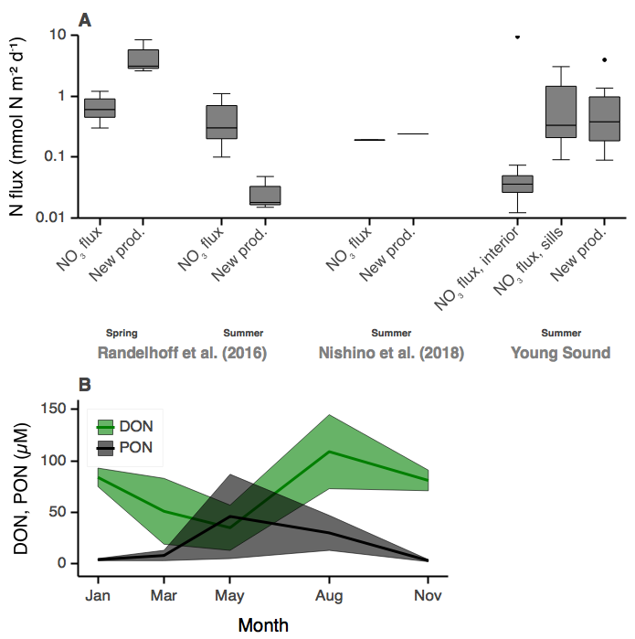
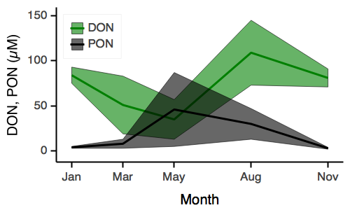
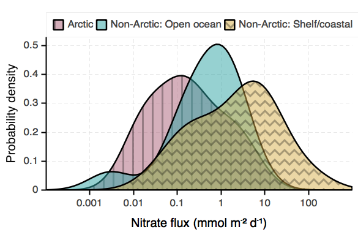

# Abstract

Arctic Ocean primary productivity is limited by light and inorganic nutrients. With recent decades' decreasing sea ice cover, nutrient limitation is thought to become more prominent. Although much has been learned about nitrate supply from general patterns of ocean circulation and water column stability, a quantitative analysis requires dedicated turbulence measurements that have only started to accumulate in the last dozen years. Here we compile published estimates of the turbulent vertical nitrate flux in the Arctic Ocean, supplemented by new observations from the Laptev Sea and Baffin Bay. Combining those with a pan-Arctic collection of in situ measurements of nitrate concentration and density, we find the annual nitrate inventory to be largely determined by the strength of stratification, but also by bathymetry. Nitrate fluxes explain the observed regional patterns and magnitudes of both primary production and particle export. We argue that with few regional exceptions, vertical nitrate fluxes are a reliable proxy of Arctic primary production accessible to autonomous and large-scale measurements. They also provide a framework to project nutrient limitation scenarios into the future based on clear energetic and mass budget constraints resulting from wind-driven and tidal mixing and freshwater flows.

# Introduction

Without upward mixing of nutrients, much of the ocean would harbour no life [@ambuehl1959bedeutung; @margalef1978life]; the Arctic Ocean is no exception. The reason is essentially that algae, in particular dead algae, and other particulate matter have the tendency to sink due to their higher density, and hence nutrients are constantly being removed from the surface waters. Phytoplankton, in turn, has to rely on nutrients being mixed up in order to be able to grow and re-build their standing stock every year. Consequently, primary production, which happens in the euphotic zone where light levels are sufficient to support net growth, should depend on how much new nitrate is brought up from below the photic zone each year.

While turbulence is a concern for aquatic life everywhere, the Arctic Ocean is special in certain regards, most notably its ubiquitous sea ice cover and the strong stratification linked to its estuary nature [@aagaard1989role]. In particular, the large summertime accumulation of meltwater under sea ice has profound impacts on the vertical mixing in the upper ocean [@mcphee1984; @randelhoff2017turbulent; @cole2018internal]. At lower latitudes, diurnal heating significantly modifies upper ocean mixing [@price1986diurnal]. In contrast, such signals are usually negligible in the Arctic Ocean due to low sun angles [@mcphee1992turbulent, but see @mcphee2008air for a rare counterexample]. The Arctic seasonal freeze-melt alternation hence dominates over diurnal cycles, such that there is often only seasonal nitrate limitation, and winter mixing is disproportionately important for setting mixed-layer properties, as will be shown throughout this paper.

Sea ice is often assumed to be a rather rigid lid that shuts out a large portion of the sunlight as well as wind energy that could otherwise mix the ocean. As much of this ice is melting in the course of the 21st century [@comiso], the factors limiting Arctic marine growth may change. Such a transition in limiting factors usually leads to difficulties in predicting systems [@allen2015unified]. Indeed, @vancoppenolle2013future found that three different coupled biogeochemical general circulation models and their predictions for integrated Arctic Ocean primary production until the end of this century show vastly diverging trajectories beyond a few decades from now. In their analysis, a prominent uncertainty concerned the resupply of nitrate to the photic zone, which is currently not well constrained. Hence one practical implication of our lack of understanding of the vertical nitrate flux is the failure to consistently predict future Arctic Ocean primary production for the rest of this century.

Whereas the vertical nitrate flux in the world ocean has received attention at least since the late 1980s [@lewis1986vertical], dedicated measurements in the Arctic Ocean have only started to accumulate in the last dozen years.

# Material & methods

This study is centered around two datasets: 1) A compilation of seawater nitrate concentration measurements across the Arctic Ocean, based on databases that were already available, and 2) a compilation of nitrate flux measurements mostly available in the published literature of the last decade, but supplemented by new calculations and measurements from Baffin Bay and the Chukchi and Laptev seas.

## NO3 compilation

Code and supplemental information available here: .ipynb

[@codispoti2013synthesis]

## FN compilation

Code and supplemental information here: .ipynb

There are just above a dozen flux estimates going back to less than ten publications (@Tbl:nitrate_fluxes).

Reference|FN|Region|Season|Sample size
---|:---:|---|---|---
@sundfjord2007observations|0.1|Barents Sea|Summer|Single station
@sundfjord2007observations|2.0|Barents Sea|Summer|Single station
@bourgault2011turbulent|0.12|Amundsen Gulf|Winter|Aggregate value
@randelhoff2015seasonal|2.5|Barents Sea, AABC|Winter|Aggregate value
this study, @nishino2015nutrient|0.02|Chukchi Sea|Summer|Single station
@randelhoff2016regional|0.01|Canada Basin|Perennial|Aggregate value
@randelhoff2016regional|0.015|Makarov Basin|Perennial|Aggregate value
@randelhoff2016regional|0.05|Amundsen Basin|Perennial|Aggregate value
@randelhoff2016regional|0.2|Nansen Basin/Yermak Plateau|Perennial|Aggregate value
@randelhoff2016vertical|0.3|N Svalbard/Fram Strait|Summer|Aggregate value
@randelhoff2016vertical|0.7|N Svalbard/Fram Strait|Summer|Aggregate value
@wiedmann2017upward|0.1|Barents Sea|Summer|Single station
@wiedmann2017upward|5.0|Barents Sea|Summer|Single station
@nishino2018biogeochemical|0.19|Chukchi Sea|Summer|Aggregate value
this study|1.7|Baffin Bay|Winter|Aggregate value
this study|0.0$^\ast$|Laptev Sea|Summer|Single station

: Nitrate fluxes observed in the Arctic Ocean. $^\ast$see Appendix, AABC: Anticyclonic Arctic Boundary Current. TBD: Add young sound nitrate flux? {#tbl:nitrate_fluxes}

### Measuring vertical nitrate fluxes

Barring regionally important processes such as upwelling [@carmack2003wind; @kampf2016upwelling; @randelhoff2018short] the most prevalent form of the upward transport of nitrate in the ocean is turbulent diffusion [@lewis1986vertical], which mixes the spent surface waters with deeper, more nutrient-rich waters, thereby replenishing their nitrate reservoir. A vertical turbulent nitrate flux is, by definition, the product of a so-called "diapycnal eddy diffusivity" with the vertical gradient of nitrate. (This is completely analogous to any other tracer such as temperature or salinity. The interested reader is referred to the vast literature on turbulent flows.)

To estimate both those quantities, one has to measure the turbulence, and a vertical profile of nitrate concentrations, respectively. Determining nitrate is the easy part because only the non-turbulent background is needed; one can use either bottle samples or, preferably, optical nitrate sensors to get a better vertical resolution [@alkire2010sensor; @randelhoff2016vertical]. While care should be taken to calibrate the absolute concentrations, such biases are usually depth-independent and hence do not matter for the calculation of the gradients [see Appendix of @randelhoff2016vertical]. Measuring turbulence is more challenging because it requires either measurements with meticulous instruments, requiring dedicated ship time and personnel, or parameterizations that add layers of uncertainty [@guthrie2013revisiting]. More detail is given in the Appendix.

## Comparison between nitrate fluxes and primary production

redfield ratio

To convert between units of carbon and nitrogen, we employed a C:N ratio of 6.6 mol C: mol N, the so-called Redfield ratio [@redfield1963influence]. This particular choice of C:N ratio may be criticized on the grounds that they vary depending on type of organic matter and other environmental factors [@refs], and that C:N ratios observed in the Arctic in particular are usually higher [@refs]. However, turbulence measurements usually come with a much larger margin of error, and we do therefore neglect these variations in our calculations. See the appendix for an extended discussion of error margins.

# Results

## Seasonal cycle of surface nitrate concentration

Winter surface nitrate concentrations in the Atlantic sector reach high values around 11 µM. In the Central Arctic Ocean, concentrations stay constant at roughly 1-3 µM N all year round, whereas in the coastal Beaufort Sea they may reach intermediate values (@Fig:NO3-COMP_chart_seasonal_cycle).

{#fig:NO3-COMP_chart_seasonal_cycle}

## Nitrate fluxes

Nitrate flux estimates are scarce given that they require co-located measurements of both turbulence and nitrate concentrations; however, they slowly approach Pan-Arctic coverage ([@Fig:FN-COMP_map]). Highest values (> 1 mmol m-2 d-1) are found in the Atlantic sector and lowest (<< 0.1 mmol m-2 d-1) in the central basins.

{#fig:FN-COMP_map}

## Nitrate flux seasonality

The seasonal cycle of surface nitrate concentration is also reflected in its upward fluxes (@Fig:FN-COMP_chart_seasonal_cycle), where the Atlantic sector shows values an order of magnitude below those in winter. The large variety of different fluxes measured in summer, on the other hand, likely reflects the higher abundance of single-station observations then. Observations over a full seasonal cycle are only available in the Barents sea / shelf slope area. In contrast, in the non-overturning regions, fluxes are lower overall, but there is not enough data to test whether the seasonality itself is, in relative terms, really much weaker there.

{#fig:FN-COMP_chart_seasonal_cycle}

# Discussion

## Nitrate fluxes as a function of stratification and seasonality

We found that the vertical nitrate flux in winter predicted the pre-bloom nitrate pool remarkably well ([@Fig:FN-COMP_chart_vs_NO3]A). Indeed, fluxes are often by an order of magnitude smaller in summer. Consequently, deep winter mixing, where it occurs, dominates the annual nitrogen budget, expanding on direct measurements of a full annual cycle over the Barents Sea shelf break [@randelhoff2015seasonal].

Given this knowledge,

{#fig:FN-COMP_chart_vs_NO3 width=50%}

Potential advective processes do hence not play as large a role at Pan-Arctic scales, at least the locations and times presented here. Our results explicitly and quantitatively confirm the qualitative perception that vertical nitrate fluxes determine the seasonality of the upper ocean nitrate inventory, as has been surmised multiple times in the literature [see e.g. @carmack2006food; @tremblay2015global] based on general considerations of stratification and bathymetry.

The two dominant factors explaining nitrate flux variability are stratification and seasonality. A number of studies and reviews has established that in terms of stratification, the Arctic Ocean can be divided into two sectors: A weakly stratified Atlantic one, and a strongly stratified Pacific one [@carmack2007alphabeta; @bluhm2015tale; @tremblay2015global]. Stratification inhibits vertical mixing [@osborn1980estimates] and hence turbulent nitrate fluxes, as has been demonstrated at a Pan-Arctic scale [@randelhoff2016regional] and between process stations on different sides of the Barents Sea polar front [@sundfjord2007observations; @wiedmann2017upward].

## Primary production constrained by nitrate fluxes

The close match between nitrate fluxes and nitrate inventory demonstrates the eminent role of stratification and turbulence in Arctic Ocean nutrient dynamics. The real value of measuring nitrate fluxes, however, lies in constraining primary production [see e.g. @tremblay2015global].

The most commonly employed notion of "primary production" is "net primary production", comprised of both new and regenerated production [@Fig:ncycle]. Due to nitrogen scarcity in summer [@Fig:NO3-COMP_map_no3_summer], regenerated production is a significant if not dominant fraction of NPP [@ref]. Hence NPP is significantly larger than the amount of inorganic nitrogen that is converted into organic matter, which is the quantity than can be reasonably expected to be constrained by nitrate fluxes. Indeed, for one ocean colour remote sensing algorithm, net primary production is at least an order of magnitude larger than the corresponding wintertime nitrate fluxes [supmat].

## New production and export production

Two other measures of primary production are more directly related to the assimilation of inorganic into organic nitrogen: First, new production [@dugdale1967uptake], which relies only on nitrate brought up from below the photic zone. It is customarily measured by incubating phytoplankton in seawater spiked with some nitrate, using a radioisotope to track its incorporation into organic matter [@collos1987calculations]. Second, export production [@eppley1979flux], which in its most basic form is measured as the downward particle export over a given time interval using sediment traps [@zeitzschel1978new]. This number is stipulated to be similar to the upward nitrate flux based on conservation of mass alone.

Over seasonal time scales, both the upward nitrate flux in winter, the particle export at 200 m depth, and new production (nitrate uptake) match up reasonably well for Baffin Bay, the Barents Sea, the Southern Beaufort Sea, and the Central basin [@Fig:PP_FN_NEWP_EXP_regional], both in regional patterns and order of magnitude. Other regions lack estimates of the winter nitrate flux. Indeed, annual budgets have to be closed if nitrate inventories are not to change in the long term.

{#fig:PP_FN_NEWP_EXP_regional}

A somewhat different matter is the hypothesis that during the summer, upward mixing of nitrate limits the amount of new production in the short term. Here, the published literature gives a less clear picture (@Fig:PP_incubations_vs_flux). @randelhoff2016vertical measured vertical nitrate flux and new production for both spring and summer in the marginal ice zone around northern Fram Strait. In spring, uptake of nitrate was considerably larger than its vertical supply as nitrate was not yet depleted and hence did not limit photosynthesis. In summer, on the other hand, when the surface water was nitrate-depleted, new production was an order of magnitude _smaller_ than nitrate supply. Although the explanation may be composite, a likely contribution to this discrepancy was the seasonal buildup of dissolved organic matter  observed during the same field campaigns ([@Fig:PP_chart_paulsen]). @paulsen2018asynchronous findings hence stressed the importance of the recycling of nitrogen in the microbial loop when considering nutrient fluxes over short subseasonal time scales. The nitrate uptake rate measurements by @randelhoff2016vertical, however, only considered assimilation into the particulate pool. @nishino2018biogeochemical found good agreement between upward nitrate flux, nitrate uptake, and export of particulate organic matter, based on a case study in the Chukchi sea. This may represent differences in methodology or in the dynamics of the system.

{#fig:PP_incubations_vs_flux}

{#fig:PP_chart_paulsen}

Diametrically opposed, @law2001lagrangian and @rees2001carbon found that vertical mixing supplied 33 % of the nitrate demand at a North Atlantic site, in agreement with a study by @horne1996turbulence in the Gulf of Maine. Even in the Mauritanian upwelling region, nitrate flues in excess of 100 mmol m-2 d-1 accounted for only 10-25% of observed net community production [@schafstall2010tidalinduced]. Even more extremely, @shiozaki2011imbalance found that one location on the continental shelf of the East China Sea "exhibited a considerable discrepancy between the nitrate assimilation rate (1500 mmolN m−2 d−1) and vertical nitrate flux (98 mmolN m−2 d−1)", and they went so far as concluding that "the assumption of a direct relationship between new production, export production, and measured nitrate assimilation is misplaced, particularly regarding the continental shelf of the \[East China Sea\]".

# Future scenarios

>Re: winter vs summer fluxes... It also means that if the ice-free season and hence also the more stratified period are prolonged, very little additional nitrogen is injected into the upper layer.

## Nitrogen limitation of primary production

Nitrogen scarcity plays a large role in constraining Arctic marine primary production [@moore2013processes; @tremblay2015global]. Nitrate limitation holds across large swaths of the Arctic, but not including some of the central basin, where summer surface concentrations are in excess of e.g. 5 µM in the Makarov Basin [@Fig:NO3-COMP_map_no3_summer]. These high nitrate concentrations are usually taken to indicate regionally important light limitation by perennial sea ice cover [@codispoti2013synthesis].

![Summer surface nitrate concentration. Nutrient limitation of phytoplankton growth is usually quantified in terms of a _half-saturation constant_ (of a Michaelis-Menten kinetics), above which nutrient uptake rates benefit less and less from increasing ambient nutrient concentrations. Reported values of such half-saturation constants vary widely according to species and physiological state, but reasonable values usually cluster around an order of magnitude of 1 µM [e.g. @wassmann2006modelling].](../nb_fig/FIGURE_NO3-COMP_map_no3_summer.png){#fig:NO3-COMP_map_no3_summer}

Regarding nitrate concentrations as indicators of potential growth however, a cautionary remark is in order. Since the nitrate supply, like phytoplankton growth, is a rate and not a stock, its present-day inventory alone does not yield sufficient information to infer possible limitations in future scenarios. Hence the summer surplus nitrate that is observed in the central AO may only be available transiently while the ice cover shrinks, but not in a steady-state situation without summer sea ice. Similarly, a deeper euphotic zone (e.g. due to a more transparent ice cover) could enhance growth in subsurface waters, richer in nutrients, but the resupply rate of nitrogen ultimately decides about potential lasting increases in new production.

@randelhoff2016regional provided estimates of end-of-century new production, given presently observed turbulence and potential future increases in stratification observed in a numerical circulation model [@nummelin2015consequences]. They concluded that there may be an approximately 50% increase in new production in the Amundsen Basin if the system were to turn to nitrate limitation in otherwise unchanged conditions; however, most of that increase may fall victim to future increases in stratification which in turn decreases fluxes.

Contrarily, @polyakov2017greater posited that an ongoing Atlantification will lead to deeper winter convection in the Eurasian Basin. In fact, Atlantic water, being less stratified, is associated with high nitrate fluxes. A spreading of Atlantic waters into the central AO could hence add upper-ocean nitrate, but no estimates of the magnitude of that effect have been published to our knowledge. As Atlantic Water is also the principal source of heat in the Arctic Ocean, it has been implicated in recent sea ice loss [@ivanov2016arctic; @polyakov2017greater], and hence could regionally add nutrients and light to the system and so relieve nutrient and light limitation at the same time [@randelhoff2018seasonality]. The recent decreases of sea ice extent in Northern Fram Strait and north of Svalbard [@onarheim2018seasonal] indicate that such a process is already well underway. Something similar might be happening in the Pacific inflow area in the Bering and Chukchi seas. On the other hand, more stratified areas with higher influence of riverine or pacific freshwater may get even more stratified and hence more nitrogen-limited.

## Ice cover and wind-driven turbulence

A decreasing sea ice cover has been hypothesized to enhance the input of wind energy into the ocean [@dosser2016dynamics], but increasing stratification will likely counteract the resulting increased mixing.

More concretely, based on a two-year mooring timeseries of velocity observations on the shallow Chukchi shelf, @rainville2009observations showed that during the period of heavy winter ice cover, water velocities, and hence consequently turbulent mixing, were strongly reduced. While less ice cover did in fact enhance input of wind energy in the perennially stratified Beaufort Sea basin in observations by @lincoln2016wind, little of that mixing lead to increases in fluxes from the intermediary warm, nutrient-rich layers due to the strong stratification. The strong stratification was also the hypothetical explanation by @guthrie2013revisiting for the lack of change in current profiler-inferred mixing estimates compared to historical records in the central Arctic Ocean basin. SImilarly, @chanona2018variability, analyzing CTD profiles collected in the Canadian Arctic using an internal-wave based finescale parameterisation, found a weak seasonal cycle in ε but no interannual trend from 2002 through 2016.

In summer, when ice is broken up and in more or less free drift, wind energy input into the upper ocean is higher in ice-covered than open water areas [@martin2016impact]. Hence retreating summer sea ice may not immediately lead to increased rates of turbulent energy dissipation. However, melting sea ice causes low-salinity water layers in the upper tens of meters  [@randelhoff2017turbulent], mean that nutrient fluxes were approximately twice as much in the open-water stations in the MIZ measured by @randelhoff2016vertical. While these increased fluxes are close to neglible in terms of total annual nitrate supply, they may slightly relax nutrient limitation during the summer and hence change plankton community composition [@li2009smallest]. In addition, if the overall loss of sea ice eventually leads to drastic changes in stratification as such, that could be an avenue to changing nutrient fluxes as well.

## Arctic nitrate fluxes in a global context

Based on a literature review  (@Tbl:nitrate_fluxes_other), Arctic vertical nitrate fluxes tend to be approximately one order of magnitude lower than in the rest of the world ocean (@Fig:FN-COMP_comparison_world). Even though study sites in the global ocean may be biased by measurements seeking to explain high biological productivity (most often as the result of strong mixing), this simple comparison demonstrates the considerable gap between potential for new and hence harvestable production in most of the Arctic Ocean and the world's fishery grounds.

Reference|FN|Region
---|---|---
@lewis1986vertical|0.14|Subtropical North Atlantic
@jenkins1988nitrate|1.6|Subtropical North Atlantic
@hamilton1989vertical re-analyzing @lewis1986vertical|0.85|Subtropical North Atlantic
@carr1995physical|1.9|Equatorial Pacific (5 °N - 5 °S)
@carr1995physical|4.3|Equatorial Pacific (1 °N - 1 °S)
@horne1996turbulence|0.047|North Atlantic, Georges Bank
@horne1996turbulence|0.18|North Atlantic, Georges Bank
@planas1999nitrate|0.38|Central Atlantic
@law2001lagrangian|1.8|Subarctic North Atlantic
@sharples2001internal|12.0|New Zealand Shelf
@law2003vertical|0.17|Antarctic Circumpolar Current
@hales2005irreversible|9.0|Oregon Shelf Upwelling System
@sharples2007springneap|1.3|Celtic Sea shelf edge (neap tide)
@sharples2007springneap|9.0|Celtic Sea shelf edge (spring tide)
@hales2009turbulent|0.9|New England shelf break front (seaward of)
@hales2009turbulent|5.2|New England shelf break front (shoreward of)
@rippeth2009diapcynal|1.5|Irish Sea
@martin2010supply|0.09|North Atlantic, Porcupine Abyssal Plain
@schafstall2010tidalinduced|1.0|Mauritanian Upwelling (offshore)
@schafstall2010tidalinduced|3.7|Mauritanian Upwelling (shelf)
@schafstall2010tidalinduced|10.0|Mauritanian Upwelling (slope)
@shiozaki2011imbalance, mean of values in their Table 1|0.25|North Pacific, East China Sea shelf
@kaneko2013observations|0.003|North Pacific, Kuroshio (south of front)
@kaneko2013observations|0.34|North Pacific, Kuroshio (north of front)
@cyr2015turbulent|0.21|St. Lawrence Gulf, Canada
@cyr2015turbulent|95.0|St. Lawrence Gulf, Canada (shallow sill)

: Nitrate fluxes in the global ocean, excluding the Arctic. $^\ast$@schafstall2010tidalinduced was given with a typo by @bourgault2011turbulent. TBD: do exhaustive/systematic literature search. {#tbl:nitrate_fluxes_other}

{#fig:FN-COMP_comparison_world}

# Conclusions

## Summary

1. Determining nitrate fluxes is a laborious task. With measurements accumulating through the last 10 years, we are now approaching a Pan-Arctic baseline. In individual regions however, perhaps with the exception of the Barents Sea, seasonal coverage remains patchy at best.
1. Arctic nitrate fluxes are, on average, one to two orders of magnitude smaller than those observed elsewhere in the world ocean.
1. The spatial patterns of the upper ocean nitrate inventory is well explained by vertical nitrate fluxes, and the seasonality in these fluxes is reflected in the seasonality of the nitrate fluxes.
1. Nitrate fluxes are a powerful tool to constrain export fluxes and new production, both of which are hard to measure autonomously. There is an important distinction between ”(net) primary production” and “new production”, highlighted by the fact that the former is approximately an order of magnitude larger than annual nitrate supply.
1. On sub-seasonal or shorter timescales, the coupling between nitrate supply and new production is unclear, mostly due to lack of appropriate time series data.
1. Advances in turbulence-ecosystem coupling will require autonomous sampling and timeseries.

## Nitrate fluxes in diagnosis and prognosis of primary production

While currently publicly available datasets are more comprehensive new and export production [@stein2004organic] than for nitrate fluxes, they posses some drawbacks when it comes to large-scale patterns. Incubations to determine new production are usually point measurements, and hence averaging them is not trivial. Sediment traps, while measuring export fluxes at a single location, integrate the time dimension, and are hence more repesentative, but also require a large logistic effort. Chemical tracer approaches [e.g. @moran2003does] make the data acquisition phase easier, but still require water samples and are hence not easily amenable to autonomous exploration. In sum, current Arctic Ocean exploration does not scale well. NO3 fluxes, on the other hand, can be estimated purely based on physical sensor data, hence with larger scope both in time and space.

Such turbulence measurements do not necessarily have to be conducted using microstructure profilers - mixing can also be estimated from current shear or density strain finestructure with more standard instruments, which may work especially well in discerning relative magnitudes but can also be calibrated using regional microstructure estimates [@gargett2008determining; @guthrie2013revisiting; @polzin2014finescale; @chanona2018variability]. Parameterizations of this kind, relying on models of internal wave breaking, are most useful away from boundaries, hence for scenarios of perennial stratification where year-round background fluxes dominate [@randelhoff2016regional], and less so to characterize near-surface mixing.

Turbulence also obeys tight physical constraints imposed by wind, tidal and other energy available for mixing, and by the freshwater (density) fluxes that cause background stratification. Hence nitrate fluxes are more easily constrained than plankton phytophysiology that is notoriously variable across species and environmental conditions.

## Perspectives

The statistical bulk approach of @randelhoff2016vertical and related work in the European Arctic focused largely on vertical transport processes. Modelling work [@watanabe2014enhanced] has led to an appraisal of the importance of mesoscale turbulence for cross-shelf transport and nutrient supply in the Chukchi sea [@nishino2019inprep]. Some studies suggest that eddies may also contribute to cross-shelf transport along the West Spitsbergen Current [@hattermann2016eddy]. @crews2018mesoscale found eddies may contribute to ventilation of halocline waters in the European Arctic, which does not directly contribute to mixed-layer nitrate but will be apparent in the upward vertical fluxes measured out of the halocline waters. @johnson2010nitrate, working in the Subtropical North Pacific, stressed the importance of event-driven upward nitrate transport not easily captured by vertical diffusivities, and even the possibility of immediate utilisation nitrate in an otherwise diabatic isopycnal excursion, for example associated with a passing eddy. Attention is required summing these contributions, however, as there is a certain danger of double counting nitrate fluxes in eddies [@martin2001mechanisms; @martin2003estimates].

Lastly, turbulent mixing is much more than only the vertical nitrate flux. It affects predator-prey interactions, nutrient uptake rates at the cell level, light exposure of individual cells, etc. In fact, mixing and variability is a resource in itself that can be exploited by different plankton life strategies. It is unlikely that these issues are going to be resolved in the field anytime soon, but they are important to keep in mind in particular when interpreting biological hotspots.

# Acknowledgments

The present paper started taking shape around the 4th "Symposium on Pan-Arctic Integration", held in Motovun, Croatia, 2017, and we thank all participants for inspiring discussions.
Data exploration and visualization relied heavily on the [Holoviews library](http://holoviews.org) [@stevens2015holoviews].

BGC-Argo Floats in Baffin Bay funded through the NAOS project.

TBD:

# Supplemental Material

The supplemental material, accessible at [https://github.com/poplarShift/arctic-nitrate-fluxes](https://github.com/poplarShift/arctic-nitrate-fluxes), contains:

- The python code necessary to reproduce all analyses and figures, licensed under GNU GPL3.
- The data, as plotted in all figures, in machine-readable formats.
- An interactive version of this article where figures can be zoomed, panned, and selectively highlighted (as appropriate) leveraging the [Bokeh library](http://bokeh.pydata.org) [@bokehdevelopmentteam2018bokeh], licensed under CC-BY 4.0 like the present document.

# Appendix

## The marine nitrogen cycle

Discussions of ocean surface nitrogen budgets center around the marine nitrogen cycle. @Fig:ncycle shows a simplified version adapted to Arctic conditions. The main component is the cycling between inorganic nitrate and particulate organic nitrogen (PON). Upward transport of NO3 compensates nitrate uptake by algae into PON [@dugdale1967uptake] and subsequent sinking of this organic matter. The loop is closed by remineralization into nitrate at depth. Because of the scarcity of nitrogen, there is also intense recycling of nitrogen that has already been assimilated into organic matter, which is called regenerated production.

{#fig:ncycle width=50%}

Additional complexity arises from a number of sources, sinks, and recycling processes not accounted for in this simplistic view. One of the conclusions of the present study is that we do not need to invoke those processes to understand Arctic surface layer budgets on a pan-Arctic scale, but they may be important depending on the regional scope.

Advection with ocean currents manifests itself largely as transport with the Pacific and Atlantic currents that e.g. @torres-valdes2013export have discussed. For the most part, these currents are subducted under local (Arctic) water masses and can hence be accounted for as part of the vertical fluxes downstream. As these currents come from further south, the surface waters they carry are as nutrient-depleted as the Arctic surface waters and hence we do not believe that. Riverine inputs are thought to be sufficiently small to be neglected at larger-than-regional scales [see e.g. @tank2012processing]. Some of the produced PON is also harvested e.g. by higher trophic levels or fisheries [e.g. @valiela2015marine], although the latter process is likely only regionally important, e.g. in the Barents Sea.

## The vertical layering of Arctic Ocean nitrate

Fluxes are easiest to measure across strong gradients. A given vertical profile of nitrate concentrations in the Arctic Ocean can schematically be vertically divided by two nitraclines: First, a seasonal one, which marks the transition from surface waters, modulated by seasonal ice meltwater and algal growth, to the remnant winter mixed layer. Second, and only present in the deep basins of the Arctic Oceans, one that we dub "perennial" as it is not eroded and re-established on an annual basis.

The seasonal nitracline is completely mixed during winter, rendering fluxes hard to estimate using the "diffusivity times gradient" formula. Across the perennial nitracline, fluxes can be estimated year-round stipulating the seasonal variations in nitracline dissipation are minor, a method exploited by @randelhoff2016regional to estimate pan-Arctic patterns of upward nitrate supply in the deep basin. In practice, the two nitraclines are often not clearly delineated. The distinctive characteristics of the two nitraclines are most easily seen in the Eurasian Basin, where deep winter mixed layers are clearly separated from underlying Atlantic Waters. In the Canadian Basin, strong stratification prevents winter mixing from penetrating deep into the nitracline [@peralta-ferriz2015seasonal], leading to relatively small seasonal excursions in surface nutrient concentrations and a less distinct winter remnant mixed layer.

## Measuring turbulence

The most direct way of determining the nitrate flux is measuring the so-called "dissipation of turbulent kinetic energy" ($\epsilon$) traditionally using free-falling microstructure profilers [@lueck2002oceanic]. $\epsilon$ can also be estimated from larger-scale current shear or strain visible in CTD profiles [@guthrie2013revisiting], even though that adds another layer of parameterizations. Once $\epsilon$ is determined, its accuracy usually cited as being within a factor of two [@ref], the vertical turbulent diffusivity can be calculated, following @osborn1980estimates, as

$$K_\rho = \Gamma\frac{\epsilon}{N^2}$$ {#eq:osborn}

where $N^2$ is the buoyancy frequency and $\Gamma\approx 0.2$ is the mixing coefficient that reflects how much of $\epsilon$ is available for adiabatic mixing. @Eq:osborn has a number of known issues, a major one of which is that $\Gamma$ is not constant. A variety of different parameterizations have been proposed [e.g. @shih2005parameterization; @bouffard2013diapycnal], with no clear alternative emerging. @Eq:osborn is hence the de facto standard [@gregg2018mixing], and in fact all turbulence-based estimates of the vertical nitrate flux compiled for this paper are based on it, albeit e.g. @sundfjord2007observations determined the value of $\Gamma$ that best fit their observations using a detailed analysis of microstructure data.

Another method to determine vertical nitrate fluxes, less direct, uses a set of nitrate profiles through fall and winter [@randelhoff2015seasonal]. It has been employed to calculate two of the fluxes presented in this study. Vertically integrating the successive differences between them, one essentially reverses the calculation of net community production by the nitrate drawdown between winter and summer [@codispoti2013synthesis]. @randelhoff2015seasonal provided a brief overview over potentially interfering processes such as nitrogen fixation and concluded they were likely not significantly disturbing the annual budgets, but it has to be acknowledged that data is sparse.

## Uncertainties

The preceding section demonstrated the uncertainties surrounding  the determination of turbulence profiles.

Oceanographers used to geochemical or biological precision may be astonished to learn that

Combining and comparing measurements of turbulent mixing, hydrography, nutrient concentrations and incubations draws from different domain-specific assumptions and conventions.

Vertical nitrate fluxes are not only difficult to estimate. Once determined, they are subject to considerable uncertainty due to the intermittent nature of turbulence and spatial variation in oceanographic flows caused by tides, varying wind, topography, and water masses with different nutrient contents. Hence comparison with estimates of primary production requires that nitrate fluxes are measured across a variety of forcing scenarios and sufficiently smoothed out.

## Regions

To facilitate comparison of our results with previous studies of Pan-Arctic oceanography, we defined several sub-regions of the Arctic Ocean (@Fig:NO3-COMP_regions), largely following @codispoti2013synthesis and @peralta-ferriz2015seasonal.

{#fig:NO3-COMP_regions}

## Nitrate flux estimate in the Laptev Sea

(markus)

### Data description

Location, vessel, time, measurements

Things to think about:

- eps much lower than Lenn et al 2011 (pretty much at shelf break).
- Is this already the inner Laptev shelf, or still outer?
- any observations of tides?

{#fig:FN-NEW_LAPTEV_map}

{#fig:FN-NEW_LAPTEV_profiles}

## Nitrate flux estimate in Baffin Bay

Three biogeochemical Argo floats overwintered in Baffin Bay from July 2017 to July 2018, described in detail by Randelhoff et al. (2019, in prep.). Integrating the nitrate deficit $\Delta NO3\equiv NO3(60 m) - NO3(z)$ over the upper 60 meters for each station shows that over the course of four months (from November to March), a deficit of 200 mmol m-2 was replenished, approximately equivalent to an upward nitrate flux of 1.66 mmol m-2 d-1.

{#fig:FN-NEW_BAFFIN}

## TBD: Include Young Sound??

# References
